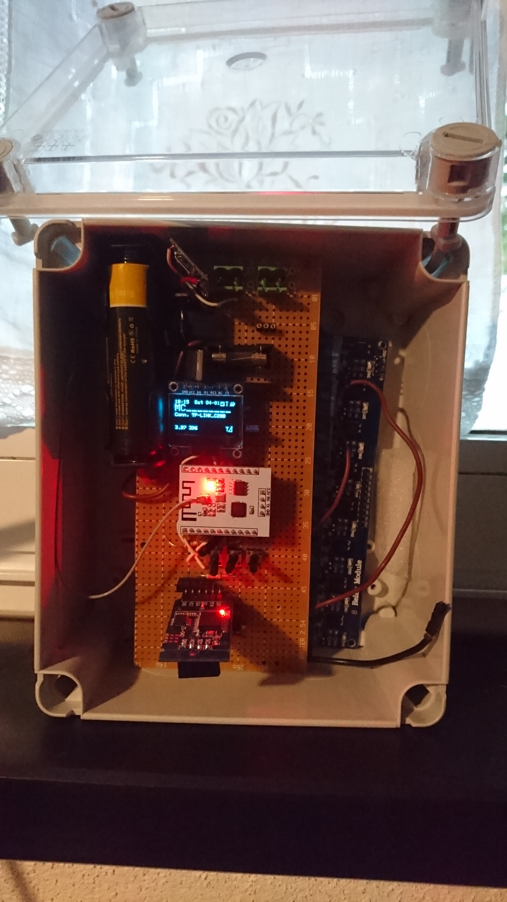
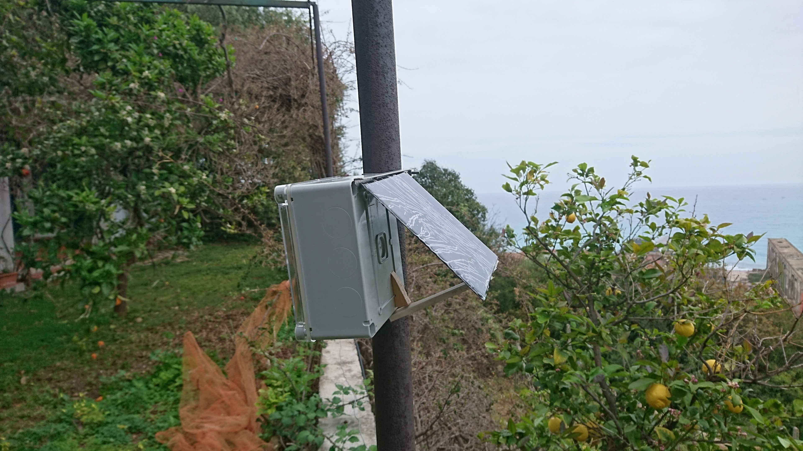
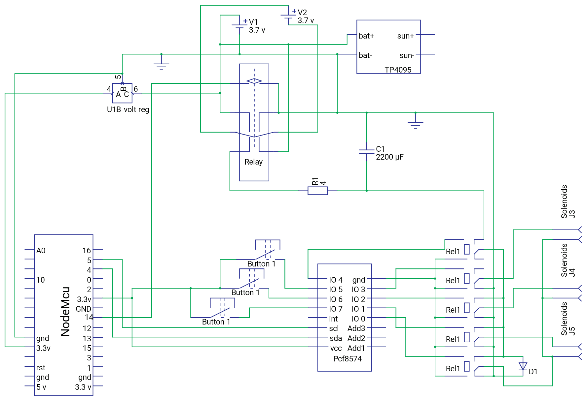

OPENSPRIKLER SOLAR

A do it yourself project to make OpenSprinkler fully autonomous.

You can use it where there is no power and Ethernet cables.

All you need is a battery powered unit based on Esp8266 a solar panel and few
self-latching valve's.

This device is fully compatible with Open Sprinkler units from
[Ray](http://OpenSprinkler.com) and with OS firmware.

A short description of the HW necessary to build the Solar Open Sprinkler unit
will follow.

   

   

>   Components List

>   This is a list of the components I have used in my first OpenSprinkler Solar
>   prototype:

1.  Solar Panel rated 5v with 5w power

2.  2 Lipo batteries 3.7v with at least 2600mAh capacity

3.  A Esp8266 MCU ( I have used an Esp8266 201 but any type should go!)

4.  A DPDT 3 v relay

5.  A capacitor 2200uF or more.

6.  A graphic I2c OLED LCD

7.  A relay board with 4 or more 5v relay

8.  A Pcf9574 I2c expander

9.  Pushbuttons, few resistors, 2 40v 1a diodes.

10. A TP4056 board to charge Lipos

11. A 3.3 volts voltage regulator IC

>   Optional:

>   A RTC board (based on Ds1307 or equivalents)

>   A Ina219 board to measure battery in&out current and voltage

DESCRIPTION

Self latching solenoids need a short pulse at 9volts to open and , inverting
polarity, to close.

To get this high voltage you may build a step-up converter (as in OS Bee 2.0) or
use the method of switching batteries from parallel to series using a DPDT
relay. Since current absorbed by solenoid is several amps in a very short pulse
, best solution is to charge a capacitor that will be discharged to operate the
solenoid.

I have used 8 5v relay in a single board to connect the solenoids.3 relays are
connected t 3 valve's positive while a 4th relay is connected to all valve's
return (negative),the 1st relay drop the charge from the capacitor to the
solenoid.

The relay input come from a PCF8574 I2c expander. This IC has 8 IO channels : 5
are used for relays the remain 3 are used for 3 pushbuttons (this way the unit
can be operated a standard OpenSprinkler unit).

Regarding power supply I used 2 Lipo18650 with2600 mAh each mounted in parallel
and a 3.3v power regulator. Considering an average power drain of 70mA , mainly
coming from the ESP, the batteries will last about 70 hours. This will mean
about 5 days of cloudy sky, since during daytime the solar panels produce as a
minimum 70mA. Batteries are charged with a TP 4056 board that may provide up to
1 amp, so a panel rated 5v 5w will be best choice to charge the batteries.

A full sunny day will charge both batteries completely, so I am confident that
the units can operate autonomously without any additional recharge.

Anyhow if batteries discharge, I have provided an hybernation mode that will
reduce consumption to less than 5mA.

This way I will preserve batteries and continuous operation of the units ( but
no web connection).

To monitor batteries status the Analog input pin of the Esp8266 can be used. I
added a Ina219 board that allow precise current and voltage reading ,but it is
not essential for the unit operation.

A real time clock can be used to keep clock in case of restart, but the unit can
work with the internal clock and an NTP synchronization.

SCHEMATICS

SOFTWARE

This project it is a branch from [Esp8266 OpenSprinkler](http://Github.com/pbecchi/OpenESP8266_!Sprinkler) developed to add
support to OS Bee 2.0 stations. The branch mods consist mainly on the support of
a graphic 128x64 OLED display and the capability to operate self latching
solenoids During this work I also added the few more functions necessary to
support the battery operations:

1.  Battery voltage monitor

2.  Battery amps charge discharge monitor (with Ina219 board)

3.  Hybernation mode control

4.  Battery status log. (not in this site copy!)

5.  Api change to include battery relevant options and status

A copy of this new OpenESP8266 Sprinkler firmware release beta has been added to this site ,
an offocial release with comments and user manual update will be uploaded soon to OpenESP8266_Sprinkler site.
